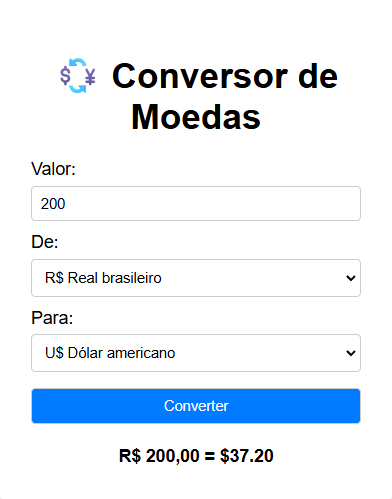

# 💱 Conversor de Moedas

Aplicação simples e funcional para conversão de moedas em tempo real, utilizando a API pública [Frankfurter.app](https://www.frankfurter.app). Desenvolvido com foco em boas práticas, clareza de código e uso inteligente de recursos nativos do JavaScript.

## 🚀 Funcionalidades

- Conversão entre moedas USD, BRL e EUR
- Formatação dinâmica dos valores com `Intl.NumberFormat`, adaptando idioma e moeda automaticamente
- Validação de campos e tratamento de erros
- Interface leve, responsiva e sem dependências externas

## 🛠️ Tecnologias utilizadas

- HTML5
- CSS3
- JavaScript (ES6)
- API Frankfurter.app

## 📦 Como executar

1. Clone o repositório:
    ```bash
    git clone https://github.com/seu-usuario/conversor-moedas.git

2. Acesse a pasta do projeto:
    cd conversor-moedas

3. Abra o arquivo index.html no navegador
    Nenhuma instalação de dependências é necessária

📸 Preview


📈 Próximas melhorias
• 	Adição de novas moedas (JPY, GBP, AUD, etc.)
• 	Detecção automática de idioma do navegador
• 	Publicação online com GitHub Pages ou Netlify
• 	Interface aprimorada com responsividade

📚 Aprendizados
• 	Consumo de APIs públicas sem autenticação
• 	Formatação de moedas com Intl.NumberFormat de forma dinâmica
• 	Boas práticas de estrutura, validação e modularização de código
• 	Publicação de projetos front-end com GitHub Pages

📌 Autor
Diego Barreiro
[LinkedIn](https://www.linkedin.com/in/diegobarreiro-dev/) • [GitHub](https://github.com/diego-barreiro)